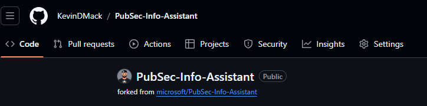
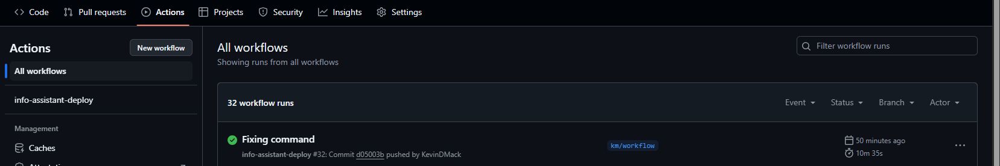
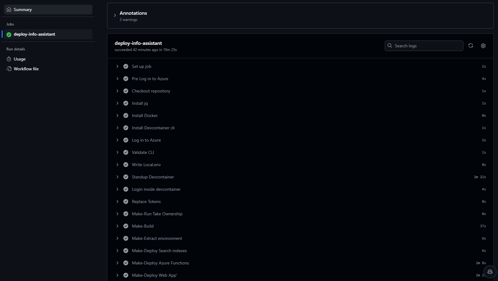

# Summary:

The requirement was to build a workflow to handle deployments of the info assistant.

## Step 1 - Create service principal:

Use the following command to create the service principal (you can run these from cloud shell, or locally with az login):

```bash
PRINCIPAL_NAME="pub-sec-info-assistant-deploy"
SUBSCRIPTION_ID="" # Subscription id

az ad sp create-for-rbac --name "pub-sec-info-assistant-deploy" --role contributor --scopes /subscriptions/$SUBSCRIPTION_ID --sdk-auth
```

You will get a json output of:

```code
{
  "clientId": "redacted",
  "clientSecret": "redacted",
  "subscriptionId": "redacted",
  "tenantId": "redacted",
  "activeDirectoryEndpointUrl": "https://login.microsoftonline.us",
  "resourceManagerEndpointUrl": "https://management.usgovcloudapi.net/",
  "activeDirectoryGraphResourceId": "https://graph.windows.net/",
  "sqlManagementEndpointUrl": "https://management.core.usgovcloudapi.net:8443/",
  "galleryEndpointUrl": "https://gallery.usgovcloudapi.net/",
  "managementEndpointUrl": "https://management.core.usgovcloudapi.net/"
}
```

You must then give the service principal the following rights at minimum:

| Resource | Description |
|----------|-------------|
| Key Vault in info-asst resource group | Role Assignment of Key Vault Secret User, and access policy give the principal get / list secrets |

## Step 2 - Create storage account for terraform backend

*NOTE: Right now the terraform infrastructure is a work-in-progress.*
Using the following commands to create the storage account on the backend (you can run these from cloud shell, or locally with az login):

```code
RG_NAME="infoasst-infra"
LOCATION="usgovvirginia"
STORAGE_ACCOUNT_NAME="infoassistterraform"
STORAGE_CONTAINER_NAME="backend"

az group create -n $RG_NAME -l $LOCATION
az storage account create --name $STORAGE_ACCOUNT_NAME--resource-group $RG_NAME --location $LOCATION --sku Standard_LRS
az storage container create --name $STORAGE_CONTAINER_NAME --account-name $STORAGE_ACCOUNT_NAME
```

## Step 3 - Create Github Secrets:

Go to the repo in a web browser and open the repo on GHES, and select "Settings" > "Secrets and Variables" > "Actions", and click "Add New Repository Secret"

| Secret | Required / Optional | Notes |
|--------|---------------------|-------|
| LOCAL_ENV | Optional - Only if you don't have the local.env file checked in.  | Copy the contents of your env file |
| AZURE_CLIENT_ID | Required | The client id for the service principal from step 1 |
| AZURE_CLIENT_SECRET | Required | The client secret for the service principal from step 1 |
| AZURE_CLIENT_TENANT_ID | Required | The tenant id for the service principal from step 1 |
| TF_BACKEND | Required | # The values from the storage account created in step 2.<br>export TF_BACKEND_RESOURCE_GROUP=""<br>export TF_BACKEND_STORAGE_ACCOUNT=""<br>export TF_BACKEND_CONTAINER=""<br>export TF_BACKEND_ACCESS_KEY="" |
| AZURE_CREDENTIALS | Required | The json output from creation of the service principal, should match this (if you want to create manually). <br> {<br>  "clientId": "redacted",<br>  "clientSecret": "redacted",<br>  "subscriptionId": "redacted",<br>  "tenantId": "redacted",<br>  "activeDirectoryEndpointUrl": "https://login.microsoftonline.us",<br>  "resourceManagerEndpointUrl": "https://management.usgovcloudapi.net/",<br>  "activeDirectoryGraphResourceId": "https://graph.windows.net/",<br>  "sqlManagementEndpointUrl": "https://management.core.usgovcloudapi.net:8443/",<br>  "galleryEndpointUrl": "https://gallery.usgovcloudapi.net/",<br>  "managementEndpointUrl": "https://management.core.usgovcloudapi.net/"<br>} |
| SUFFIX | Required | The random string of your deployed environment.  This is the suffix on the resources.   |
| AOAI_SERVICE_NAME | Required | The name of the Azure OpenAI Service. |
| AOAI_RESOURCE_GROUP_NAME | Required | The resource group of your AOAI service. |
| CONTAINER_REGISTRY_PASSWORD | Required | The password of the container registry in the resource group of the deployment. |
| INFO_ASSIST_RESOURCE_GROUP | Required | The resource group of the Info Assist deployed instance. |

## Step 4 - Create a new branch on your 

You should now create a new branch on your repo, for detailed instructions with VSCode, see the following [Source Control with Git in Visual Studio Code](https://code.visualstudio.com/docs/sourcecontrol/overview#_branches-and-tags).

## Step 5 - Adding / Updating inf_output.json

There is a file that is generated during the infrastructure deployment that is required for subsequent steps to make sure that we can pull environment information.  

The following steps will help you to get this file into source control for use in the workflow.  

**NOTE: Do not commit the existing file as it contains secrets that must be kept out of source control.**

1. Go to your [./.gitignore](/.gitignore), and remove the line that says "inf_output.json", this will make source control track the file.

1. Replace the contents of the file with the following, this is a tokenized version of the file for us in the deployment.  The content can be found [./inf_output.json](/inf_output.json).  The workflow will use secrets to populate.  

## Step 6 - Copy the Workflow file

For this step, you will want to copy the workflow file [/.github/workflows/info-assistant.yml](/.github/workflows/info-assistant.yml).  

**Note: To test your workflow, you will want to change the following section of the workflow to match your new branches name.**

```code
on: 
    workflow_dispatch:
    push:
        branches:
         - main # Change to match your branch
```

## Step 7 - Commit the changes for your branch:

You can then commit your changes, confirm that you have the correct files included:

- ./inf_output.json
- ./.gitignore
- ./.github/workflows/info-assistant.yml

For information on doing a commit, see the following [Source Control with Git in Visual Studio Code](https://code.visualstudio.com/docs/sourcecontrol/overview#_commit).  

## Step 8 - Push Changes

After performing the commit, you would then want to do a publish of your branch, by hitting the "Publish Branch" button on the source control menu.  

## Step 9 - Monitor your github workflow

To monitor your github workflow, go to the repo via a web browser, and click the "Actions" button shown below:



This will then show you a menu where you can see all workflows for a repo, you should see your info-assistant-deploy appear there.



By selecting on a run, and then selecting the "deploy-info-assistant" step, you can see the details of a run as follows:

